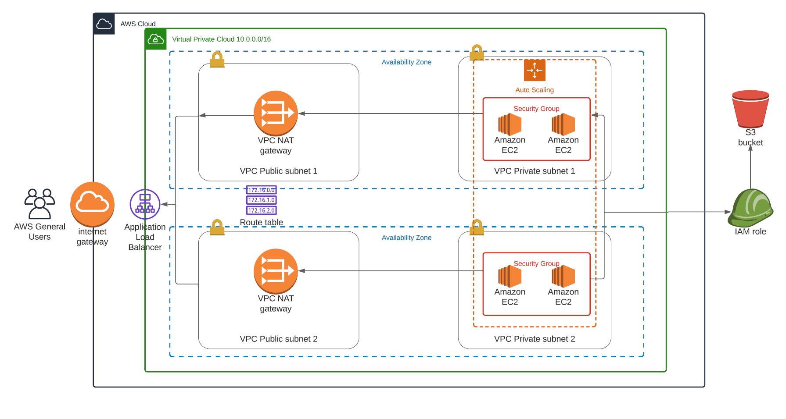

## Udacity DevOps Engineer Nanodegree Project 2 ( Deploy a High-Availability Web App using CloudFormation(IAC)).

This project deploys resourses for a highly available WebApp using CloudFormation.
It creates and deploys the infrastructure and application for an Instagram-like app
from the ground up. Deployment begins with the networking components, followed by servers,
security roles and software. The application code is deployed from the S3 bucket using appropriate role.

### Description
Create a Launch Configuration in order to deploy four servers, two located in each of
your private subnets. The launch configuration will be used by an auto-scaling group. You'll need two vCPUs and at least 4GB of RAM. The Operating System to be used is Ubuntu 18. So, choose an Instance size and Machine Image (AMI) that best fits this spec. Be sure to allocate at least 10GB of disk space so that you don't run into issues.

### Architecture

### Files included:

- network.yaml - CloudFormation network infrastructure stack description.
- network-params.json - Parameters file for the network infrastructure stack
- servers.yaml - CloudFormation services infrastructure stack description
- servers-params.json - Parameters file for the services infrastructure stack
- create.sh - bash script for creating resources stack
- update.sh - bash script for creating resources stack
- project-infrastructure-diagram.pdf - infrastructure diagram

### Running the project:

1. Execute network infrastructure stack.
  Usage: create.sh stackname network.yaml network-params.json

2. Upon step 1 successful completion, execute services infrastructure stack
  Usage: create.sh stackname servers.yaml servers-params.json

### Output
Services stack outputs the final website URL.

Load Balance Landing Page http://udaci-webap-nb1s62w6gvkm-766922845.us-east-1.elb.amazonaws.com/
